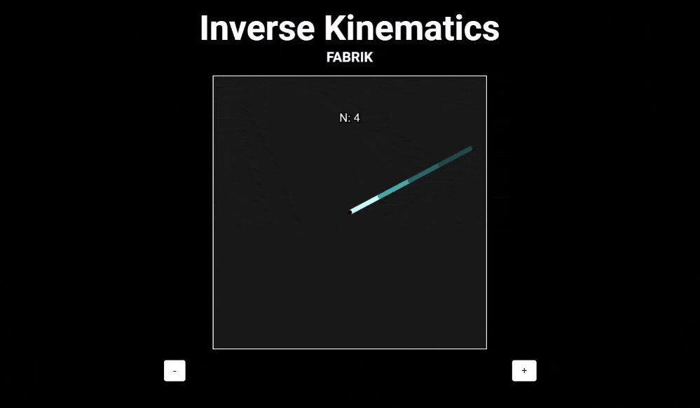

# Inverse Kinematics Project

This project demonstrates the implementation of inverse kinematics using the p5.js library. It showcases how to control the movement of a multi-jointed arm to reach a target point in a 2D space. The project includes interactive elements to visualize and manipulate the arm's behavior.

## Algorithm

- FABRIK (Forward And Backward Reaching Inverse Kinematics) algorithm is used to calculate the joint angles of the arm.
- The algorithm involves two main steps: forward reaching and backward reaching.

## Features

- Change the number of segments in the arm.
- Follow mouse cursor

## Showcase

